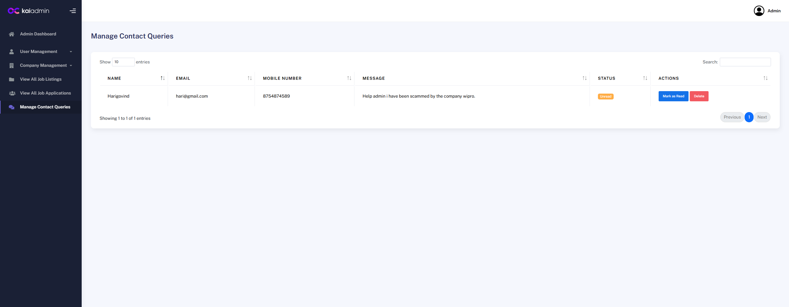
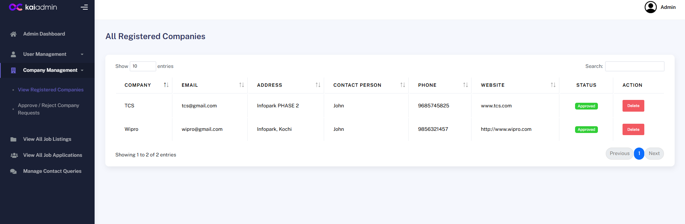
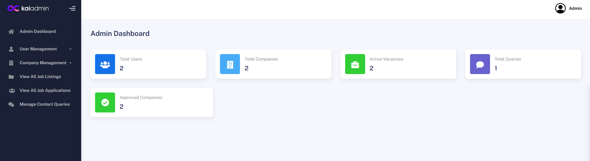
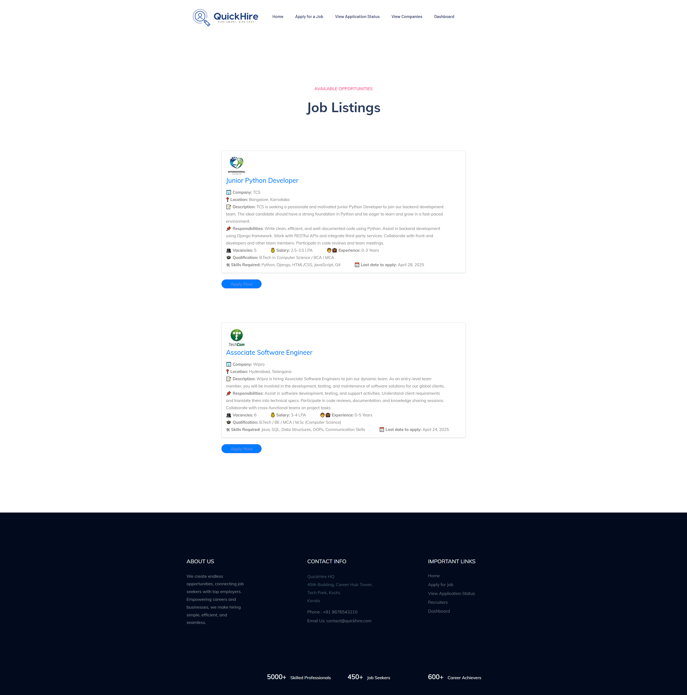
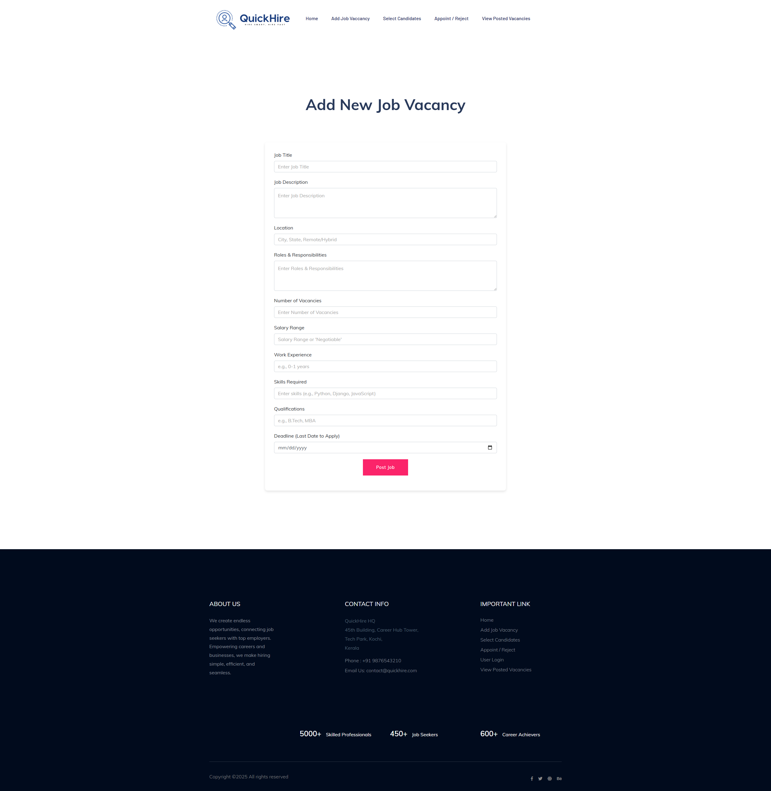
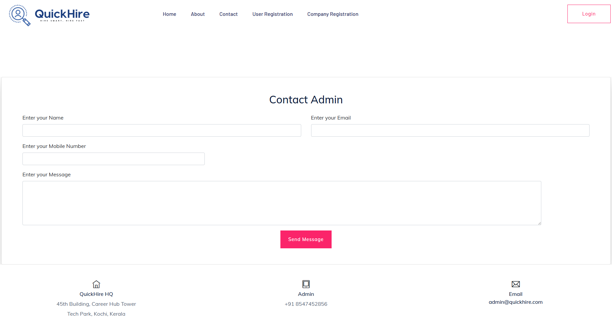

# Online Job Portal using Python Django🚀

## Overview

This Python-based Online Job Portal, developed using the Django web framework, serves as a dynamic platform that seamlessly connects job seekers with companies offering diverse employment opportunities. The portal facilitates an end-to-end recruitment process, enabling companies to register, post job vacancies, and manage applications, while job seekers can create profiles, apply for jobs, and track application statuses.

## Features
- **User & Company Registration:** Separate registration and login systems for job seekers and companies, with admin approval required for companies.
  
- **Company Dashboard:**
  -Company Profile updation & Password Reseting. 
  - Post job vacancies with specific skill sets, qualifications and job details.
  - View and manage posted jobs.Where deadline passed jobs will be automatically deleted or can be manually deleted by the company.
  - Review applications received from the user with job desctiption beside the job application. After close inspection of user profile and resume, company can either shortlist or reject candidate.
  - Shortlisted candidates are assigned with an Interview date and an Email verification about the Interview Details.
  - After Interview company either appoint the user or reject him/her. An Email conformation is also provided here.
    
- **User Dashboard:**
  - Create and manage a personal profile with professional details, including resume upload and skills.
  - Browse and apply for job vacancies based on preferred criteria such as skill sets, location, and qualifications.
  - Track the status of job applications, with notifications for updates such as "Shortlisted" or "Interview Date Fixed."
  - View detailed job descriptions along with company profiles and job requirements before applying.
  - Receive email notifications about the application status, interview schedules, and any other updates from companies.
  - Edit personal information, update the resume, and apply to new job listings at any time.

- **Admin Dashboard:**
  - Review and approve newly registered companies; only approved companies (AC) can post jobs and access the platform fully.
  - Manage all user and company accounts, with options to deactivate, delete, or update access rights.
  - Monitor job postings across the platform, including the ability to delete inappropriate or expired listings.
  - Oversee application flows between users and companies to ensure fair usage and detect suspicious activities.
  - Access analytics and reports on user activity, job postings, application trends, and platform performance.
  - Manage security features such as CSRF protection and ensure data privacy compliance across the platform.

## Technology Used
- **Programming Language:** Python
- **Libraries/Frameworks:**
  - Django (backend framework)
  - Bootstrap (frontend styling)
- **Database:** SQLite (easily replaceable with PostgreSQL or MySQL)
- **Authentication:** Django Auth (separate roles for Employee and Employer)
- **Frontend:** HTML, CSS, Bootstrap
- **Development Environment:** VS Code, PyCharm, or similar IDEs

## Installation

Follow these steps to set up the project on your local machine using the ZIP file:

1. **Download the project ZIP:**

   - Go to the [GitHub repository](https://github.com/yourusername/job-portal-project).
   - Click on the green **Code** button and select **Download ZIP**.
   - Extract the ZIP file to your desired location.

2. **Navigate to Pycharm and open the extracted file as new project:**

   ```bash
   open as new project
   
3. **Install the required dependencies:**

   ```bash
   pip install django
   pip install pyttsx3
   pip install pillow
   
4. **Apply database migrations:**

   Run the following commands to create the necessary database tables:

   ```bash
   python manage.py makemigrations
   python manage.py migrate
   
5. **Create a superuser (for admin access):**

   Run the following command to create an admin account:

   ```bash
   python manage.py createsuperuser
   
6. **Run the development server:**

   To start the development server, use the following command:

   ```bash
   python manage.py runserver
7. **Access the application:**

   - Open your web browser and go to `http://127.0.0.1:8000/` to use the Job Portal.
   - To access the django admin panel, go to `http://127.0.0.1:8000/admin/` and log in using the superuser credentials you created in Step 5.

## Screenshots








